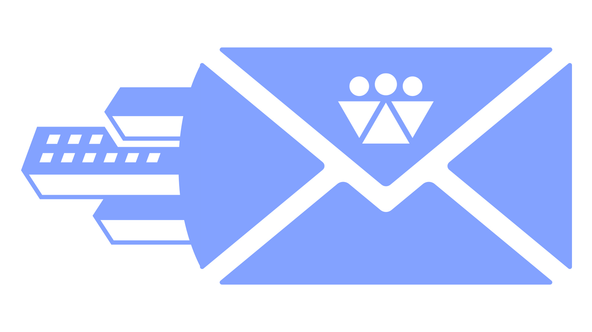
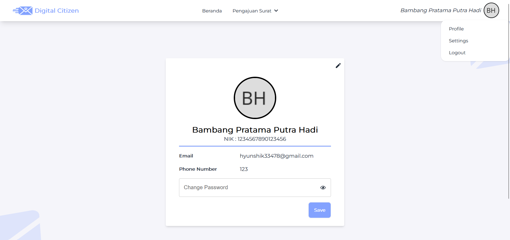
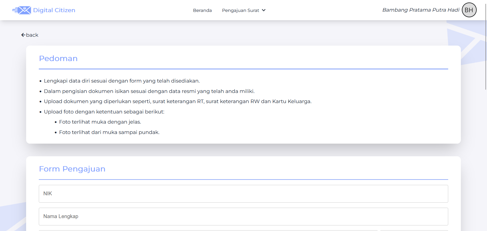
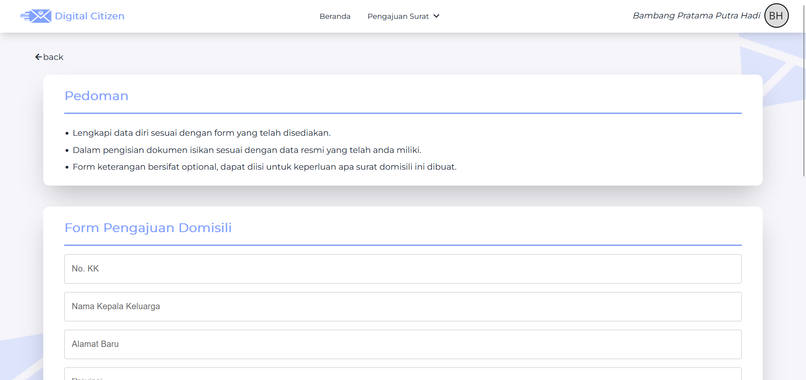
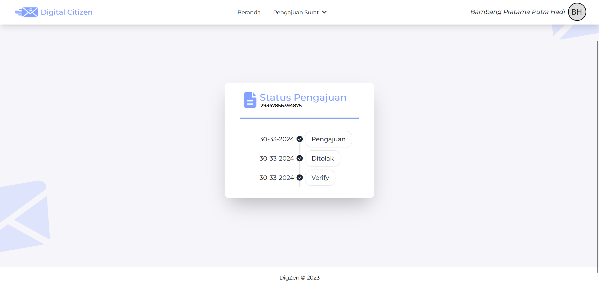

<div id="top"></div>

<!-- PROJECT LOGO -->

<br />
<div align="center">
  <a href="https://github.com/Project-Digital-Citizen/Back-End">
    
  </a>

<h3 align="center">Digital Citizen</h3>

  <p align="center">
    Ease your way with Digital Citizen
    <br />
    <a href="#top"><strong>Explore the docs »</strong></a>
    <br />
    <br />
    <a href="https://digzen.site">View Deployed App</a>
    ·
    <a href="https://github.com/Project-Digital-Citizen/Back-End">Report Bug</a>
    ·
    <a href="https://github.com/Project--Citizen/Back-End">Request Feature</a>
  </p>
</div>

<!-- TABLE OF CONTENTS -->
<details>
  <summary>Table of Contents</summary>
  <ol>
    <li>
      <a href="#about-the-project">About The Project</a>
      <ul>
        <li><a href="#built-with">Built With</a></li>
      </ul>
    </li>
    <li>
      <a href="#getting-started">Getting Started</a>
      <ul>
        <li><a href="#prerequisites">Prerequisites</a></li>
        <li><a href="#installation">Installation</a></li>
      </ul>
    </li>
    <li><a href="#roadmap">Roadmap</a></li>
    <li><a href="#contact">Contact</a></li>
    <li><a href="#acknowledgments">Acknowledgments</a></li>
  </ol>
</details>

<!-- ABOUT THE PROJECT -->

## About Digital Citizen







Website "Digital Citizen" dirancang untuk meningkatkan efisiensi dan aksesibilitas dalam proses pengajuan surat menyurat pada lembaga kemasyarakatan desa/kelurahan. Melalui pengembangan website, tim proyek berupaya memberikan solusi praktis untuk mengatasi kendala dalam pengajuan surat yang seringkali lambat dan tidak efektif akibat proses manual.

Project Digital Citizen dibangun untuk memenuhi tugas akhir atau Capstone Project pada program Studi Independen Bersertifikat - Batch 5.

<p align="right">(<a href="#top">back to top</a>)</p>

### Built With

#### FRONT-END

- [HTML](https://html.com/)
- [Javascript](https://www.javascript.com/)
- [Tailwind](https://tailwindcss.com/)

### BACK-END

- [Express](https://expressjs.com/)
- [MongoDB](https://www.mongodb.com/)

#### APIs

- [Digital Citizen API](https://api.digzen.site) See docs [here](https://github.com/Project-Digital-Citizen/Back-End)

<p align="right">(<a href="#top">back to top</a>)</p>

<!-- GETTING STARTED -->

## Getting Started

How to install local Digital Citizen on your laptop? let's follow the instructions

### Prerequisites

- Node Js (v14.17.6 or higher)

### Installation

#### Note

This project required API KEY from [Digital Citizen](https://api.digzen.site).

1. Clone this repository (main branch)
   ```sh
   https://github.com/Project-Digital-Citizen/Front-End
   ```
2. Install NPM packages
   ```sh
   npm install
   ```
3. Create file `.env` in root project folder
   ```js
   BASE_URL_API = "http://localhost:3000"; // FOR DEVELOPMENT
   BASE_URL_API = "https://api.digzen.site"; // FOR BACK-END
   ```
4. Run the server!
   ```sh
   npm run dev
   ```
   Yeay! Server running on [localhost](http://localhost:5173/)
   #### Optional
   For the styling development please run tailwind, open new tab on terminal.
   ```sh
   npm run tailwind
   ```
   To build this project for production, run command
   ```sh
   npm run build
   ```
   <p align="right">(<a href="#top">back to top</a>)</p>

<!-- ROADMAP -->

## Roadmap

- [x] Build Backend for APIs, [see this](https://github.com/Project-Digital-Citizen/Back-End)
- [x] Tasks
- [x] Eisenhower Matrix
- [x] Pomodoro
- [x] History of completed task
- [x] Articles productivity
- [x] Progressive Web App
- [x] Notification service
- [x] Landing page
- [x] How to use

<p align="right">(<a href="#top">back to top</a>)</p>

<!-- CONTACT -->

## Contact

- [Westlee Matthew Agustinus](https://www.linkedin.com/in/westlee-matthew-agustinus-542783195?utm_source=share&utm_campaign=share_via&utm_content=profile&utm_medium=android_app)
- [Fadiyah Dhara Al Arsya](https://www.linkedin.com/in/fadiyaharsya/)
- [Yoel Steady Valentino](https://www.linkedin.com/in/yoelsteadyvalentino)
- [Muh. Deni Setiawan](https://id.linkedin.com/in/muh-deni-setiawan-d19082002)
- [Bambang Pratama Putra Hadi](https://www.linkedin.com/in/bambang-pratama-putra-hadi-419b36290)

<p align="right">(<a href="#top">back to top</a>)</p>

<!-- ACKNOWLEDGMENTS -->

## Acknowledgments

- [MDN Web Docs](https://developer.mozilla.org/)
- [Workbox](https://developer.chrome.com/docs/workbox/)
- [Tailwind](https://tailwindcss.com/)
- [Flowbite](https://flowbite.com/)
- [EsLint](https://eslint.org/)
- [SweetAlert](https://sweetalert2.github.io/)
- [Stack Overflow](https://stackoverflow.com/)
- [Youtube](https://www.youtube.com/)

<p align="right">(<a href="#top">back to top</a>)</p>
